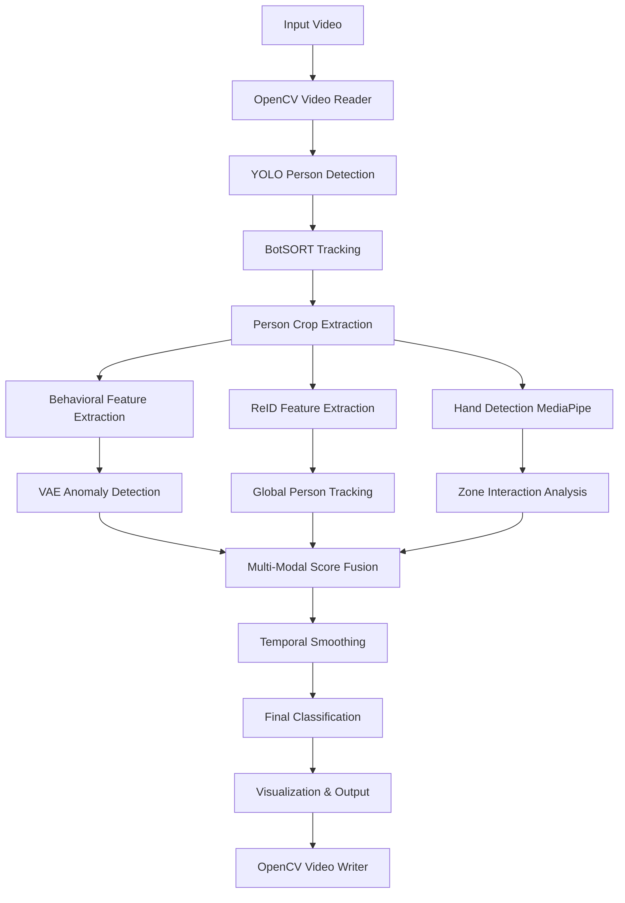

# 🏗️ Technical Architecture: Library Integration & Data Flow

## 🎯 System Architecture Overview

This document provides a detailed technical view of how all libraries and tools integrate to create the complete CCTV anomaly detection system.

---

## 📊 **Data Flow Architecture**



---

## 🔧 **Library Integration by Component**

### **1. Video Processing Pipeline**

#### **Input/Output Layer**
```python
# OpenCV: Video I/O and basic processing
import cv2

class VideoProcessor:
    def __init__(self, video_path):
        self.cap = cv2.VideoCapture(video_path)          # Video input
        self.fps = int(self.cap.get(cv2.CAP_PROP_FPS))   # Frame rate
        self.width = int(self.cap.get(cv2.CAP_PROP_FRAME_WIDTH))
        self.height = int(self.cap.get(cv2.CAP_PROP_FRAME_HEIGHT))
        
    def setup_writer(self, output_path):
        fourcc = cv2.VideoWriter_fourcc(*'mp4v')         # Codec selection
        self.writer = cv2.VideoWriter(output_path, fourcc, self.fps, (self.width, self.height))
```

#### **Frame Processing**
```python
# OpenCV: Frame-level operations
def process_frame(self, frame):
    # Color space conversion for different models
    rgb_frame = cv2.cvtColor(frame, cv2.COLOR_BGR2RGB)   # For MediaPipe
    gray_frame = cv2.cvtColor(frame, cv2.COLOR_BGR2GRAY) # For analysis
    
    return rgb_frame, gray_frame
```

---

### **2. Person Detection & Tracking**

#### **YOLO Integration**
```python
# Ultralytics: State-of-the-art object detection
from ultralytics import YOLO

class PersonDetector:
    def __init__(self):
        self.model = YOLO("yolov8n.pt")  # Nano model for speed
        
    def detect_and_track(self, frame):
        results = self.model.track(
            source=frame,
            tracker="botsort.yaml",      # BotSORT configuration
            persist=True,                # Maintain track IDs
            classes=[0],                 # Person class only
            conf=0.4,                    # Confidence threshold
            verbose=False
        )
        return results
```

#### **Tracking Configuration (YAML)**
```yaml
# botsort.yaml: Tracking parameters
tracker_type: botsort
track_high_thresh: 0.7
track_low_thresh: 0.3
new_track_thresh: 0.8
match_thresh: 0.9
proximity_thresh: 0.3
appearance_thresh: 0.7
```

---

### **3. Person Re-Identification System**

#### **PyTorch/TorchVision Integration**
```python
# PyTorch + TorchVision: Deep learning for ReID
import torch
import torch.nn as nn
from torchvision.models import resnet50
import torchvision.transforms as transforms

class PersonReIDModel(nn.Module):
    def __init__(self):
        super(PersonReIDModel, self).__init__()
        # Pre-trained ResNet50 backbone
        self.backbone = resnet50(pretrained=True)
        self.backbone.fc = nn.Identity()  # Remove classification layer
        
        # Custom ReID head
        self.feature_proj = nn.Sequential(
            nn.Linear(2048, 2048),
            nn.BatchNorm1d(2048),
            nn.ReLU(inplace=True),
            nn.Dropout(0.5)
        )
    
    def forward(self, x):
        features = self.backbone(x)
        reid_features = self.feature_proj(features)
        return nn.functional.normalize(reid_features, p=2, dim=1)
```

#### **Feature Extraction Pipeline**
```python
# Image preprocessing for ReID
class ReIDPreprocessor:
    def __init__(self):
        self.transform = transforms.Compose([
            transforms.ToPILImage(),
            transforms.Resize((256, 128)),  # Standard ReID size
            transforms.ToTensor(),
            transforms.Normalize(
                mean=[0.485, 0.456, 0.406],  # ImageNet statistics
                std=[0.229, 0.224, 0.225]
            )
        ])
    
    def preprocess(self, person_crop):
        return self.transform(person_crop).unsqueeze(0)
```

#### **Similarity Computation**
```python
# Scikit-learn: Cosine similarity for matching
from sklearn.metrics.pairwise import cosine_similarity
import numpy as np

def find_best_match(query_features, gallery_features, threshold=0.85):
    similarities = cosine_similarity([query_features], gallery_features)[0]
    max_similarity = np.max(similarities)
    
    if max_similarity >= threshold:
        best_match_idx = np.argmax(similarities)
        return best_match_idx, max_similarity
    return None, 0.0
```

---

### **4. Hand Detection & Interaction Analysis**

#### **MediaPipe Integration**
```python
# MediaPipe: Real-time hand detection
import mediapipe as mp

class HandDetector:
    def __init__(self):
        self.mp_hands = mp.solutions.hands
        self.hands = self.mp_hands.Hands(
            static_image_mode=False,
            max_num_hands=4,
            min_detection_confidence=0.5,
            min_tracking_confidence=0.5
        )
        self.mp_draw = mp.solutions.drawing_utils
    
    def detect_hands(self, rgb_frame):
        results = self.hands.process(rgb_frame)
        hand_data = []
        
        if results.multi_hand_landmarks:
            for idx, landmarks in enumerate(results.multi_hand_landmarks):
                # Extract bounding box from landmarks
                h, w, _ = rgb_frame.shape
                x_coords = [lm.x * w for lm in landmarks.landmark]
                y_coords = [lm.y * h for lm in landmarks.landmark]
                
                bbox = [
                    int(min(x_coords)), int(min(y_coords)),
                    int(max(x_coords)), int(max(y_coords))
                ]
                
                hand_data.append({
                    'bbox': bbox,
                    'center': [(bbox[0] + bbox[2])/2, (bbox[1] + bbox[3])/2],
                    'landmarks': landmarks
                })
        
        return hand_data
```

#### **Zone Interaction Analysis**
```python
# NumPy: Geometric computations for zone analysis
def check_hand_zone_interaction(hand_center, interaction_zones):
    interactions = []
    
    for zone in interaction_zones:
        x1, y1, x2, y2 = zone['bbox']
        hx, hy = hand_center
        
        # Check if hand is within zone
        if x1 <= hx <= x2 and y1 <= hy <= y2:
            # Calculate distance to zone center
            zone_center = zone['center']
            distance = np.linalg.norm(
                np.array(hand_center) - np.array(zone_center)
            )
            
            interactions.append({
                'zone_id': zone['id'],
                'distance': distance,
                'density': zone['density']
            })
    
    return interactions
```

---

### **5. Behavioral Feature Extraction**

#### **NumPy-based Feature Engineering**
```python
# NumPy: Efficient numerical computations
import numpy as np

class BehavioralFeatureExtractor:
    def __init__(self, sequence_length=60):
        self.sequence_length = sequence_length
        self.track_histories = {}
    
    def extract_motion_features(self, positions):
        """Extract motion-based features"""
        if len(positions) < 2:
            return np.zeros(15)  # Return zero features
        
        # Calculate velocities and speeds
        velocities = np.diff(positions, axis=0)
        speeds = np.linalg.norm(velocities, axis=1)
        
        # Multi-scale analysis
        features = []
        for window in [10, 30, 60]:
            if len(speeds) >= window:
                recent_speeds = speeds[-window:]
                features.extend([
                    np.mean(recent_speeds),
                    np.std(recent_speeds),
                    np.max(recent_speeds),
                    np.min(recent_speeds),
                    np.percentile(recent_speeds, 75) - np.percentile(recent_speeds, 25)
                ])
            else:
                features.extend([0, 0, 0, 0, 0])
        
        return np.array(features)
    
    def extract_trajectory_features(self, positions):
        """Extract trajectory-based features"""
        if len(positions) < 3:
            return np.zeros(7)
        
        # Path analysis
        path_segments = np.linalg.norm(np.diff(positions, axis=0), axis=1)
        path_length = np.sum(path_segments)
        displacement = np.linalg.norm(positions[-1] - positions[0])
        
        # Tortuosity (path efficiency)
        tortuosity = path_length / displacement if displacement > 0 else 0
        
        # Bounding box of trajectory
        min_coords = np.min(positions, axis=0)
        max_coords = np.max(positions, axis=0)
        trajectory_area = np.prod(max_coords - min_coords)
        
        return np.array([
            path_length, displacement, tortuosity,
            np.std(path_segments), trajectory_area,
            max_coords[0] - min_coords[0],  # width
            max_coords[1] - min_coords[1]   # height
        ])
```

---

### **6. VAE Anomaly Detection**

#### **PyTorch VAE Implementation**
```python
# PyTorch: Variational Autoencoder for anomaly detection
import torch
import torch.nn as nn
import torch.nn.functional as F

class VariationalAutoEncoder(nn.Module):
    def __init__(self, input_dim=256, hidden_dim=64, latent_dim=16):
        super(VariationalAutoEncoder, self).__init__()
        
        # Encoder network
        self.encoder = nn.Sequential(
            nn.Linear(input_dim, hidden_dim * 2),
            nn.ReLU(),
            nn.Dropout(0.2),
            nn.Linear(hidden_dim * 2, hidden_dim),
            nn.ReLU(),
            nn.Dropout(0.2)
        )
        
        # Latent space parameters
        self.fc_mu = nn.Linear(hidden_dim, latent_dim)
        self.fc_logvar = nn.Linear(hidden_dim, latent_dim)
        
        # Decoder network
        self.decoder = nn.Sequential(
            nn.Linear(latent_dim, hidden_dim),
            nn.ReLU(),
            nn.Dropout(0.2),
            nn.Linear(hidden_dim, hidden_dim * 2),
            nn.ReLU(),
            nn.Dropout(0.2),
            nn.Linear(hidden_dim * 2, input_dim),
            nn.Sigmoid()
        )
    
    def encode(self, x):
        h = self.encoder(x)
        mu = self.fc_mu(h)
        logvar = self.fc_logvar(h)
        return mu, logvar
    
    def reparameterize(self, mu, logvar):
        std = torch.exp(0.5 * logvar)
        eps = torch.randn_like(std)
        return mu + eps * std
    
    def decode(self, z):
        return self.decoder(z)
    
    def forward(self, x):
        mu, logvar = self.encode(x)
        z = self.reparameterize(mu, logvar)
        recon_x = self.decode(z)
        return recon_x, mu, logvar
```

#### **Training Pipeline**
```python
# PyTorch + Scikit-learn: Training and preprocessing
from sklearn.preprocessing import StandardScaler

class VAETrainer:
    def __init__(self, model, device='auto'):
        self.model = model
        self.device = torch.device('cuda' if torch.cuda.is_available() and device == 'auto' else 'cpu')
        self.model.to(self.device)
        self.scaler = StandardScaler()
    
    def train(self, features, epochs=100, batch_size=32, lr=0.001):
        # Normalize features
        normalized_features = self.scaler.fit_transform(features)
        
        # Create data loader
        dataset = torch.utils.data.TensorDataset(
            torch.FloatTensor(normalized_features)
        )
        dataloader = torch.utils.data.DataLoader(
            dataset, batch_size=batch_size, shuffle=True
        )
        
        # Optimizer
        optimizer = torch.optim.Adam(self.model.parameters(), lr=lr)
        
        # Training loop
        self.model.train()
        for epoch in range(epochs):
            total_loss = 0
            for batch_data, in dataloader:
                batch_data = batch_data.to(self.device)
                
                optimizer.zero_grad()
                recon_batch, mu, logvar = self.model(batch_data)
                
                # VAE loss: reconstruction + KL divergence
                recon_loss = F.mse_loss(recon_batch, batch_data, reduction='sum')
                kld_loss = -0.5 * torch.sum(1 + logvar - mu.pow(2) - logvar.exp())
                loss = recon_loss + 0.1 * kld_loss
                
                loss.backward()
                optimizer.step()
                total_loss += loss.item()
        
        # Calculate anomaly threshold
        self.model.eval()
        reconstruction_errors = []
        with torch.no_grad():
            for batch_data, in dataloader:
                batch_data = batch_data.to(self.device)
                recon_batch, _, _ = self.model(batch_data)
                errors = torch.mean((batch_data - recon_batch) ** 2, dim=1)
                reconstruction_errors.extend(errors.cpu().numpy())
        
        # Set threshold at 95th percentile
        self.threshold = np.percentile(reconstruction_errors, 95.0)
        return self.threshold
```

---

### **7. Zone Learning & Clustering**

#### **Scikit-learn DBSCAN Integration**
```python
# Scikit-learn: Unsupervised clustering for zone learning
from sklearn.cluster import DBSCAN
from sklearn.preprocessing import StandardScaler

class AdaptiveZoneLearner:
    def __init__(self):
        self.interaction_points = []
        self.zones = []
    
    def learn_zones_from_interactions(self, interaction_points):
        if len(interaction_points) < 10:
            return []
        
        # Normalize points for clustering
        scaler = StandardScaler()
        normalized_points = scaler.fit_transform(interaction_points)
        
        # Apply DBSCAN clustering
        clustering = DBSCAN(
            eps=0.5,        # Neighborhood size
            min_samples=5   # Minimum points per cluster
        ).fit(normalized_points)
        
        labels = clustering.labels_
        n_clusters = len(set(labels)) - (1 if -1 in labels else 0)
        
        # Create zone definitions
        zones = []
        points_array = np.array(interaction_points)
        
        for cluster_id in range(n_clusters):
            cluster_mask = labels == cluster_id
            cluster_points = points_array[cluster_mask]
            
            # Calculate zone properties
            center = np.mean(cluster_points, axis=0)
            std = np.std(cluster_points, axis=0)
            
            # Define zone boundaries
            zone = {
                'id': f'learned_zone_{cluster_id}',
                'center': center.tolist(),
                'bbox': [
                    center[0] - 2*std[0], center[1] - 2*std[1],
                    center[0] + 2*std[0], center[1] + 2*std[1]
                ],
                'density': np.sum(cluster_mask) / len(interaction_points),
                'point_count': int(np.sum(cluster_mask))
            }
            zones.append(zone)
        
        return zones
```

---

### **8. Multi-Modal Score Fusion**

#### **NumPy-based Score Combination**
```python
# NumPy: Efficient score fusion and temporal analysis
class MultiModalScoreFusion:
    def __init__(self):
        self.weights = {
            'behavioral': 0.6,    # VAE anomaly score
            'interaction': 0.3,   # Hand-zone interactions
            'motion': 0.1         # Motion patterns
        }
        self.history_window = 15
        self.score_histories = {}
    
    def fuse_scores(self, person_id, behavioral_score, interaction_score, motion_score):
        # Weighted combination
        combined_score = (
            self.weights['behavioral'] * behavioral_score +
            self.weights['interaction'] * interaction_score +
            self.weights['motion'] * motion_score
        )
        
        # Update history
        if person_id not in self.score_histories:
            self.score_histories[person_id] = []
        
        self.score_histories[person_id].append(combined_score)
        
        # Keep only recent history
        if len(self.score_histories[person_id]) > self.history_window:
            self.score_histories[person_id] = self.score_histories[person_id][-self.history_window:]
        
        # Temporal smoothing
        if len(self.score_histories[person_id]) >= 10:  # Minimum history
            smoothed_score = np.mean(self.score_histories[person_id])
        else:
            smoothed_score = 0.0  # Not enough data
        
        return combined_score, smoothed_score
```

---

### **9. Visualization & Output**

#### **OpenCV Advanced Visualization**
```python
# OpenCV: Comprehensive visualization system
class AdvancedVisualizer:
    def __init__(self):
        self.colors = {
            'normal': (0, 255, 0),      # Green
            'suspicious': (0, 165, 255), # Orange
            'anomaly': (0, 0, 255)      # Red
        }
    
    def draw_person_analysis(self, frame, person_data):
        bbox = person_data['bbox']
        global_id = person_data['global_id']
        local_id = person_data['local_id']
        anomaly_score = person_data['anomaly_score']
        behavior_category = person_data['category']
        
        x1, y1, x2, y2 = [int(coord) for coord in bbox]
        color = self.colors[behavior_category]
        
        # Main bounding box
        cv2.rectangle(frame, (x1, y1), (x2, y2), color, 3)
        
        # Comprehensive label
        label = f"G:{global_id} L:{local_id} {behavior_category.upper()}"
        if anomaly_score > 0:
            label += f" ({anomaly_score:.2f})"
        
        # Label background
        label_size = cv2.getTextSize(label, cv2.FONT_HERSHEY_SIMPLEX, 0.6, 2)[0]
        cv2.rectangle(frame, (x1, y1-label_size[1]-10), (x1+label_size[0], y1), color, -1)
        cv2.putText(frame, label, (x1, y1-5), cv2.FONT_HERSHEY_SIMPLEX, 0.6, (255,255,255), 2)
        
        # Anomaly score bar
        if anomaly_score > 0:
            bar_width = 100
            bar_height = 8
            bar_x, bar_y = x1, y1 - label_size[1] - 25
            
            # Background
            cv2.rectangle(frame, (bar_x, bar_y), (bar_x+bar_width, bar_y+bar_height), (50,50,50), -1)
            
            # Score bar
            score_width = int(bar_width * min(anomaly_score, 1.0))
            cv2.rectangle(frame, (bar_x, bar_y), (bar_x+score_width, bar_y+bar_height), color, -1)
        
        return frame
    
    def draw_system_info(self, frame, system_stats):
        # System information overlay
        info_lines = [
            f"Frame: {system_stats['current_frame']}/{system_stats['total_frames']}",
            f"Active Persons: {system_stats['active_persons']}",
            f"Anomalies: {system_stats['anomaly_count']}",
            f"FPS: {system_stats['fps']:.1f}"
        ]
        
        # Background
        cv2.rectangle(frame, (10, 10), (300, 120), (0, 0, 0), -1)
        cv2.rectangle(frame, (10, 10), (300, 120), (255, 255, 255), 2)
        
        # Text
        for i, line in enumerate(info_lines):
            cv2.putText(frame, line, (20, 35 + i*25), cv2.FONT_HERSHEY_SIMPLEX, 0.6, (255,255,255), 2)
        
        return frame
```

---

### **10. Performance Monitoring**

#### **TQDM Progress Tracking**
```python
# TQDM: Progress monitoring for long operations
from tqdm import tqdm
import time

class PerformanceMonitor:
    def __init__(self):
        self.frame_times = []
        self.processing_stats = {}
    
    def process_video_with_progress(self, video_path, total_frames):
        with tqdm(total=total_frames, desc="Processing video") as pbar:
            for frame_idx in range(total_frames):
                start_time = time.time()
                
                # Process frame here
                # ... processing logic ...
                
                # Update timing
                frame_time = time.time() - start_time
                self.frame_times.append(frame_time)
                
                # Update progress bar
                avg_fps = 1.0 / np.mean(self.frame_times[-30:]) if len(self.frame_times) >= 30 else 0
                pbar.set_postfix({
                    'FPS': f'{avg_fps:.1f}',
                    'Frame_time': f'{frame_time:.3f}s'
                })
                pbar.update(1)
```

---

## 🔄 **Complete Integration Example**

```python
# Complete system integration showing all libraries working together
class CompleteCCTVSystem:
    def __init__(self):
        # Initialize all components
        self.yolo_model = YOLO("yolov8n.pt")                    # Ultralytics
        self.vae_detector = VAEAnomalyDetector()                # PyTorch
        self.reid_tracker = PersonReIDTracker()                # PyTorch + TorchVision
        self.hand_detector = HandDetector()                     # MediaPipe
        self.zone_learner = AdaptiveZoneLearner()              # Scikit-learn
        self.score_fusion = MultiModalScoreFusion()            # NumPy
        self.visualizer = AdvancedVisualizer()                 # OpenCV
        self.performance_monitor = PerformanceMonitor()        # TQDM
    
    def process_video(self, video_path, output_path):
        # OpenCV: Video I/O
        cap = cv2.VideoCapture(video_path)
        fps = int(cap.get(cv2.CAP_PROP_FPS))
        total_frames = int(cap.get(cv2.CAP_PROP_FRAME_COUNT))
        
        writer = cv2.VideoWriter(output_path, cv2.VideoWriter_fourcc(*'mp4v'), fps, (width, height))
        
        # TQDM: Progress tracking
        with tqdm(total=total_frames, desc="Processing") as pbar:
            frame_idx = 0
            
            while True:
                ret, frame = cap.read()
                if not ret:
                    break
                
                # 1. YOLO: Person detection
                detections = self.yolo_model.track(frame, classes=[0], conf=0.4)
                
                # 2. MediaPipe: Hand detection
                rgb_frame = cv2.cvtColor(frame, cv2.COLOR_BGR2RGB)
                hands = self.hand_detector.detect_hands(rgb_frame)
                
                # Process each detected person
                for detection in detections:
                    bbox = detection['bbox']
                    track_id = detection['track_id']
                    
                    # 3. PyTorch: ReID feature extraction
                    person_crop = frame[bbox[1]:bbox[3], bbox[0]:bbox[2]]
                    global_id = self.reid_tracker.update_tracking(track_id, person_crop)
                    
                    # 4. NumPy: Behavioral feature extraction
                    behavioral_features = self.extract_behavioral_features(track_id, bbox, frame_idx)
                    
                    # 5. PyTorch: VAE anomaly detection
                    is_anomaly, anomaly_score = self.vae_detector.detect_anomaly(behavioral_features)
                    
                    # 6. Hand-zone interaction analysis
                    person_hands = self.get_person_hands(bbox, hands)
                    interaction_score = self.analyze_interactions(person_hands)
                    
                    # 7. NumPy: Multi-modal score fusion
                    motion_score = self.calculate_motion_score(track_id)
                    combined_score, smoothed_score = self.score_fusion.fuse_scores(
                        global_id, anomaly_score, interaction_score, motion_score
                    )
                    
                    # 8. Classification
                    behavior_category = self.classify_behavior(smoothed_score)
                    
                    # 9. OpenCV: Visualization
                    person_data = {
                        'bbox': bbox,
                        'global_id': global_id,
                        'local_id': track_id,
                        'anomaly_score': smoothed_score,
                        'category': behavior_category
                    }
                    frame = self.visualizer.draw_person_analysis(frame, person_data)
                
                # Write output frame
                writer.write(frame)
                
                # Update progress
                pbar.update(1)
                frame_idx += 1
        
        # Cleanup
        cap.release()
        writer.release()
```

---

This technical architecture demonstrates how all libraries seamlessly integrate to create a sophisticated, production-ready CCTV anomaly detection system with state-of-the-art performance and reliability.